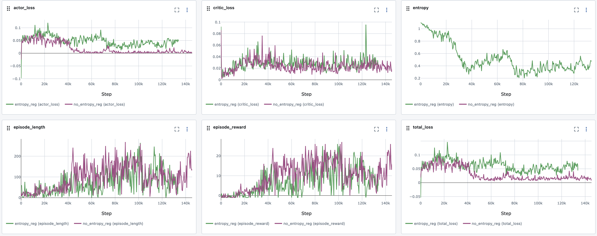

# Reinforcement learning experiments
Learning RL by implementing and analysing different RL methods from scratch.

| Directory | Game | Number of agents | RL method |
|-|-|-|-
| [nim-dqn](./nim-dqn/) | [Nim-21](https://en.wikipedia.org/wiki/Nim#The_21_game) | 2 | Deep Q-network |
| [nim-a2c](./nim-a2c/) | [Nim-21](https://en.wikipedia.org/wiki/Nim#The_21_game) | 2 | Advantage Actor Critic |
| [matching-pennies-a2c](./matching-pennies-a2c/) | [Matching Pennies](https://en.wikipedia.org/wiki/Matching_pennies) | 2 | Advantage Actor Critic |
| [snake-a2c](./snake-a2c/) | [Snake](https://en.wikipedia.org/wiki/Snake_(video_game_genre)) | 1 | Advantage Actor Critic |
| [snake-ppo](./snake-ppo/) | [Snake](https://en.wikipedia.org/wiki/Snake_(video_game_genre)) | 1 | Proximal Policy Optimisation |

## MLFlow

I'm also using this project to learn more about [MLFlow](https://mlflow.org/docs/latest/getting-started/intro-quickstart/index.html). Some of the train scripts depend on an actively running tracking server. Please check [MLFlow documentation](https://mlflow.org/docs/latest/getting-started/intro-quickstart/index.html) on how to start a tracking server and set the `MLFLOW_URI` environment variable to the correct tracking server URL.

