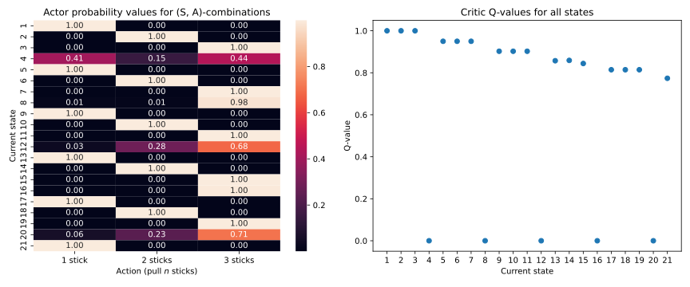

# Multi-agent A2C for Nim-21

Two agents that learn to play Nim-21 using PyTorch and A2C. Both agents learn the game-theory optimal strategy. The critic values show which states are winning and losing.

