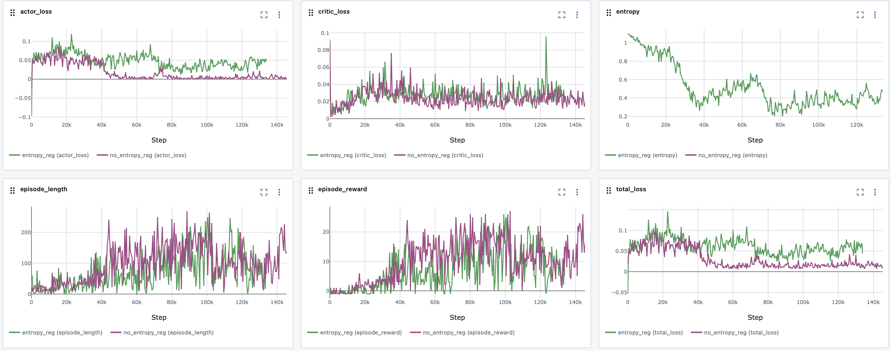

# Learning Snake using A2C
A2C adapted to learn Snake. We observe that the reward (#apples eaten) steadily goes up as more episodes pass.

Here's an illustration of a game:

We observe that the critic value goes down after each eaten apple, illustrating the snake's tendency to die right after eating an apple. 

### Training run without entropy regularisation

From the actor and critic loss over time, we see that the agent seems to reach a steady state where the actor loss is close to zero and the critic loss is significantly higher. This indicates that the critic is still struggling to accurately predict the value of states. 

Entropy regularisation encourages exploration and can prevent premature convergence, which leads to the next experiment:

### Training run with entropy regularisation

The actor loss is significantly higher, however the performance does not seem to improve over the model without entropy regularisation.
