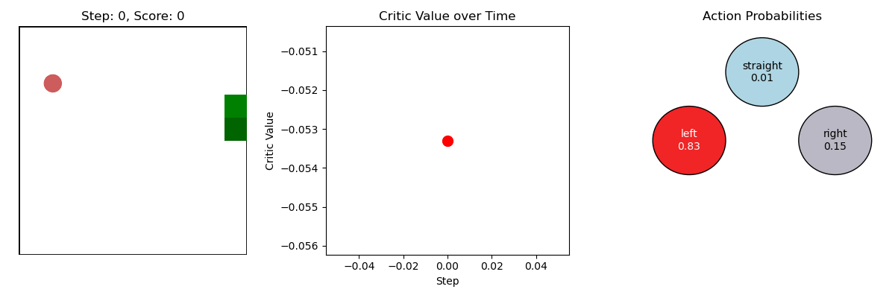

# Learning Snake using A2C
A2C adapted to learn Snake. We observe that the reward (#apples eaten) steadily goes up as more episodes pass.

Here's an illustration of a game:

We observe that the critic value goes down after each eaten apple, illustrating the snake's tendency to die right after eating an apple. 
