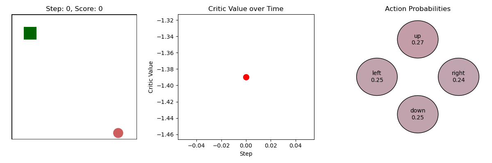

# (WIP) Learning Snake using Proximal Policy Optimisation
Uses PPO to learn Snake. PPO builds upon TRPO (I haven't implemented this), but estimates the Kullback-Leibler divergence by clipping which makes PPO more compute efficient. This implementation contains better replay memory (see the `PPOMemory` class and compare against a simple `deque`) than the A2C implementation which allows for the implementation of Generalised Advantage Estimation (GAE). The actor and critic are split, which allows us to implement clipping on the actor while keeping the critic unconstrained. We also use multiple epochs of updates on the same data for better sample efficiency.  

<!-- A2C adapted to learn Snake. We observe that the reward (#apples eaten) steadily goes up as more episodes pass.

Here's an illustration of a game:

We observe that the critic value goes down after each eaten apple, illustrating the snake's tendency to die right after eating an apple.  -->
